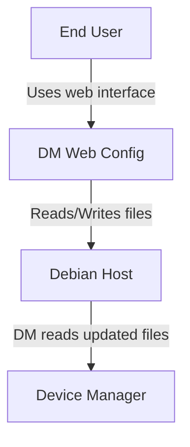

# Device Manager Web Configuration

> A modern, user-friendly web interface for configuring Device Manager systems running on Debian hardware

[](LICENSE)
[](https://openjdk.org/projects/jdk/17/)
[](https://spring.io/projects/spring-boot)
[](https://reactjs.org/)
[](https://www.typescriptlang.org/)

---

## 📋 Overview

The Device Manager Web Configuration interface provides a professional web-based solution for managing configuration files on Debian-based detection systems. Built with modern technologies and following Material UI design principles, it offers an intuitive experience for configuring detection devices, network settings, and system parameters.

### Key Features

✨ **Modern UI/UX**
- Material UI components with Observis green theme
- Sidebar navigation with grouped sections
- Real-time validation with instant feedback
- Change tracking with visual indicators
- Responsive design for desktop and tablet

💾 **Save All Changes**
- Modify multiple configurations
- Single save operation for all changes
- Atomic updates with one system reboot
- Clear confirmation of what's being saved

🔧 **Device Configuration**
- **IBAC2** - Biological detection (serial interface)
- **S900** - Radiation detection (network interface)
- **GTD Module-B** - Chemical detection (network interface)
- **WXT53X** - Weather station (serial interface)

🌐 **Network Management**
- Static IP or DHCP configuration
- Debian `/etc/network/interfaces` editing
- Real-time IPv4 validation
- Safe configuration with warnings

🛡️ **Validation & Safety**
- Frontend and backend validation
- MQTT topic format checking
- IPv4 address validation
- Port number range checking
- Device-specific rules

🧪 **Comprehensive Testing**
- Unit tests (JUnit 5, Vitest)
- Integration tests
- E2E tests (Playwright)
- >80% code coverage

---

## 🚀 Quick Start

### Prerequisites

- Java 17+
- Node.js 20.18.3
- Maven 3.9+
- Docker & Docker Compose (optional, for production)

### Development Mode (5 Minutes)

**1. Clone & Setup:**
```bash
git clone <repository-url>
cd DM-web-conf

# Setup Node version
nvm install 20.18.3
nvm use 20.18.3
```

**2. Start Application:**
```bash
./START_APP.sh
```

**3. Access UI:**
Open browser to http://localhost:3000

**4. Try It Out:**
- Navigate using the sidebar
- Make changes in "DM Details"
- Notice 🟠 orange dot on the tab
- Modify "Server Connection" too
- Click "Save Changes"
- Confirm to save all

**5. Stop:**
```bash
./STOP_APP.sh
```

### Production Deployment

```bash
# Ensure /opt/dm/ directories exist with config files
docker-compose up -d

# Access at http://<debian-ip>:80
```

---

## 📂 Project Structure

```
DM-web-conf/
├── backend/                      # Spring Boot REST API
│   ├── src/
│   │   ├── main/
│   │   │   ├── java/             # Application code
│   │   │   │   └── com/observis/dmconfig/
│   │   │   │       ├── controller/    # REST endpoints
│   │   │   │       ├── service/       # Business logic
│   │   │   │       └── validation/    # Input validation
│   │   │   └── resources/
│   │   │       ├── application.properties       # Dev config
│   │   │       ├── application-prod.properties  # Prod config
│   │   │       └── dev-data/          # Sample data for dev
│   │   └── test/                      # Backend tests
│   ├── pom.xml                   # Maven configuration
│   ├── settings.xml              # Maven settings (use Central)
│   └── Dockerfile
│
├── frontend/                     # React + TypeScript + Vite
│   ├── src/
│   │   ├── components/           # React components
│   │   │   ├── DevicesTab.tsx         # DM Details page
│   │   │   ├── ConfigPropertiesTab.tsx # Server Connection
│   │   │   ├── DeviceTab.tsx          # Device configs
│   │   │   ├── NetworkConfigTab.tsx   # Network settings
│   │   │   └── __tests__/             # Component tests
│   │   ├── api/                  # API client
│   │   ├── utils/                # Utilities & validation
│   │   └── App.tsx               # Main application
│   ├── e2e/                      # Playwright E2E tests
│   ├── public/
│   │   ├── ms-bio.svg            # IBAC2 icon
│   │   ├── ms-rad.svg            # S900 icon
│   │   └── ms-chem.svg           # GTD Module-B icon
│   ├── package.json
│   ├── vite.config.ts
│   └── Dockerfile
│
├── docs/                         # Documentation
│   ├── guides/
│   │   ├── quick-start-guide.md       # Getting started
│   │   └── development-guide.md       # Developer docs
│   ├── testing/
│   │   ├── e2e-test-guide.md          # E2E testing
│   │   └── tdd-plan.md                # TDD plan
│   ├── requirements/
│   │   └── requirements.md            # Requirements spec
│   ├── architecture/
│   │   ├── context.mermaid            # System context
│   │   ├── container.mermaid          # Containers
│   │   └── component.mermaid          # Components
│   ├── API.md                    # API documentation
│   └── FEATURES.md               # Feature list
│
├── docker-compose.yml            # Container orchestration
├── START_APP.sh                  # Quick start script
├── STOP_APP.sh                   # Stop script
└── README.md                     # This file
```

---

## 🎨 User Interface

### Navigation

**Sidebar Menu Structure:**

```
┌─ Main Section ─────────────────┐
│ 📄 DM Details                  │
│ 🌐 Network Config              │
│ 🔌 Server Connection           │
├─ Device Settings ──────────────┤
│ 🧬 IBAC2 (Biological)          │
│ ☢️  S900 (Radiation)            │
│ 🧪 GTD Module-B (Chemical)     │
│ ☁️  WXT53X (Weather)            │
└─────────────────────────────────┘
```

**Visual Indicators:**
- ✅ Green highlight = Current page
- 🟠 Orange dot = Unsaved changes
- No indicator = No changes

### Configuration Pages

#### DM Details
Configure Device Manager identification:
- **Device Manager Key**: MQTT topic identifier (max 20 chars)
- **Device Manager Name**: Human-readable name (max 50 chars)

#### Network Configuration
Manage Debian network interface:
- Interface selection (eth0, enp0s3, etc.)
- DHCP or Static IP
- IP address, netmask, gateway (for static)
- ⚠️ Triggers immediate system reboot

#### Server Connection
Configure MQTT broker connection:
- **Broker IP**: IPv4 address
- **Port**: Default 1883, or 8883 for TLS

#### Device-Specific Configuration

**Serial Devices (IBAC2, WXT53X):**
- Serial port (ttyS0/ttyS1)
- Baud rate (9600-115200)
- Data/stop bits, parity
- Port type (RS232/RS485)

**Network Devices (S900):**
- IP address
- Port number (default: 21012)

**Network Devices (GTD Module-B):**
- Network device IP address
- Port number (default: 80)

### Save Workflow

**Multi-Tab Save Process:**

1. 📝 Make changes in any/all tabs
2. 🔍 Visual indicators show modified tabs (orange dots)
3. 💾 Click "Save Changes" button (enabled when changes exist)
4. 📋 Review confirmation dialog listing all tabs to save
5. ✅ Confirm to save all configurations
6. 🔄 System reboots once after all saves complete
7. 🎉 Success notification with list of saved tabs

**Validation:**
- Real-time validation as you type
- All modified tabs validated before save
- Error message shows which tabs have validation errors
- Must fix all errors before saving

---

## 🔌 API Endpoints

### Configuration Management

| Method | Endpoint | Description |
|--------|----------|-------------|
| GET | `/api/devices` | Get device manager config |
| POST | `/api/save` | Save devices or properties config |
| GET | `/api/config/properties` | Get server connection config |
| GET | `/api/device/{name}` | Get device-specific config |
| POST | `/api/device/{name}` | Save device config |
| GET | `/api/network` | Get network configuration |
| POST | `/api/network` | Save network & trigger reboot |
| POST | `/api/reboot` | Trigger system reboot |

**Device Names:** `IBAC`, `S900`, `oritestgtdb`, `wxt53x`

### Example Usage

```bash
# Get device manager config
curl http://localhost:8080/api/devices

# Save configuration
curl -X POST http://localhost:8080/api/save \
  -H "Content-Type: application/json" \
  -d '{"configType":"devices","data":{"deviceManagerKey":"DM-1","deviceManagerName":"Station 1"}}'

# Get IBAC2 config
curl http://localhost:8080/api/device/IBAC

# Save network config (triggers reboot)
curl -X POST http://localhost:8080/api/network \
  -H "Content-Type: application/json" \
  -d '{"interface":"eth0","method":"static","address":"192.168.1.100","netmask":"255.255.255.0","gateway":"192.168.1.1"}'
```

📖 **Full API Documentation:** See [`docs/API.md`](docs/API.md)

---

## ✅ Validation Rules

### Device Manager (devices.json)

| Field | Rules |
|-------|-------|
| deviceManagerKey | Max 20 chars, alphanumeric + `space - _ .` only, no `/` `#` `+` |
| deviceManagerName | Max 50 chars, any characters |

### Server Connection (config.properties)

| Field | Rules |
|-------|-------|
| mqtt.broker | Valid IPv4 address |
| mqtt.port | Port number 1-65535 |

### Device Configurations

**Serial Devices (IBAC2, WXT53X):**
- address: `ttyS0` or `ttyS1`
- speed: `9600`, `19200`, `38400`, `57600`, or `115200`
- bits: `7` or `8`
- stopBits: `1` or `2`
- parity: `None`, `Even`, or `Odd`
- serialPortType: `RS232` or `RS485`
- name: Max 50 chars

**Network Devices (S900):**
- address: Valid IPv4
- portNumber: 1-65535, default 21012
- name: Max 50 chars

**Network Devices (GTD Module-B):**
- address: Valid IPv4
- portNumber: 1-65535, default 80
- name: Max 50 chars

### Network Configuration

| Field | Rules |
|-------|-------|
| interface | Any valid interface name |
| method | `static` or `dhcp` |
| address | Valid IPv4 (required for static) |
| netmask | Valid IPv4 (required for static) |
| gateway | Valid IPv4 (optional) |

---

## 🧪 Testing

### Run Tests

**Backend:**
```bash
cd backend
mvn test -s settings.xml                   # All tests
mvn test -Dtest="*EndToEnd*" -s settings.xml  # E2E only
```

**Frontend:**
```bash
cd frontend
npm test                    # Unit tests
npm run test:e2e           # E2E tests (headless)
npm run test:e2e:ui        # E2E tests (interactive)
```

### Test Coverage

**Backend:**
```bash
cd backend
mvn test jacoco:report -s settings.xml
# Report: target/site/jacoco/index.html
```

**Frontend:**
```bash
cd frontend
npm run test:coverage
# Report: coverage/index.html
```

### Test Structure

**Backend Tests:**
- Unit: Service, Controller, Validation layers
- Integration: Full workflow tests
- E2E: Complete API workflows

**Frontend Tests:**
- Unit: Components, Utilities
- Integration: User workflows
- E2E: Complete UI workflows (Playwright)

📖 **Full Testing Guide:** See [`docs/testing/e2e-test-guide.md`](docs/testing/e2e-test-guide.md)

---

## 🏗️ Architecture

### System Context



### Technology Stack

**Backend:**
- Spring Boot 3.2.0
- Java 17
- Maven 3.9+
- Jackson (JSON processing)

**Frontend:**
- React 18.3.1
- TypeScript 5.5.3
- Material UI 7.3.4
- Vite 5.3.3
- Axios 1.7.2

**Testing:**
- JUnit 5 (backend)
- Vitest (frontend unit)
- Playwright (frontend E2E)

**Deployment:**
- Docker & Docker Compose
- Nginx (frontend)
- Multi-stage builds

📖 **Architecture Diagrams:** See [`docs/architecture/`](docs/architecture/)

---

## 🔧 Development

### Environment Setup

**Prerequisites:**
```bash
# Install Node Version Manager
curl -o- https://raw.githubusercontent.com/nvm-sh/nvm/v0.39.0/install.sh | bash

# Install Node 20.18.3
nvm install 20.18.3
nvm use 20.18.3

# Verify versions
java -version    # Should be 17+
node --version   # Should be v20.18.3
mvn --version    # Should be 3.9+
```

### Running Locally

**Backend:**
```bash
cd backend
mvn spring-boot:run -s settings.xml
# Runs on http://localhost:8080
# Uses dev profile (src/main/resources/dev-data/)
```

**Frontend:**
```bash
cd frontend
npm install
npm run dev
# Runs on http://localhost:3000
# Hot reload enabled
```

### Configuration Profiles

**Development Profile** (default):
- Uses `src/main/resources/dev-data/` for configs
- Simulated reboot (no actual system reboot)
- Detailed logging
- No `/opt/dm/` setup required

**Production Profile**:
- Uses `/opt/dm/` for configs
- Actual system reboot via `reboot.sh`
- Standard logging
- Requires proper file structure on host

### Code Style

**Backend (Java):**
- Spring Boot conventions
- Comprehensive JavaDoc for public APIs
- Small, focused methods

**Frontend (TypeScript):**
- Functional components with hooks
- Props interfaces for all components
- Descriptive variable names

📖 **Development Guide:** See [`docs/guides/development-guide.md`](docs/guides/development-guide.md)

---

## 🐳 Docker Deployment

### Production Deployment

**1. Prepare Host:**
```bash
# Create directories
sudo mkdir -p /opt/dm/devices.d
sudo mkdir -p /opt/dm/scripts

# Create config files
sudo touch /opt/dm/devices.json
sudo touch /opt/dm/config.properties

# Create reboot script
cat <<EOF | sudo tee /opt/dm/scripts/reboot.sh
#!/bin/bash
sudo reboot
EOF

sudo chmod +x /opt/dm/scripts/reboot.sh
```

**2. Deploy:**
```bash
docker-compose up -d
```

**3. Access:**
```
http://<debian-ip>:80
```

### File Mounts

The following host paths are mounted into containers:

```
/opt/dm/devices.json           → Device manager config
/opt/dm/config.properties      → Server connection config
/opt/dm/devices.d/IBAC.json    → IBAC2 config
/opt/dm/devices.d/S900.json    → S900 config
/opt/dm/devices.d/oritestgtdb.json → GTD Module-B config
/opt/dm/devices.d/wxt53x.json  → WXT53X config
/opt/dm/scripts/reboot.sh      → Reboot script
/etc/network/interfaces        → Network configuration
```

### Container Management

```bash
# View logs
docker-compose logs -f

# Restart services
docker-compose restart

# Stop and remove
docker-compose down

# Update and rebuild
git pull
docker-compose down
docker-compose build
docker-compose up -d
```

---

## 📚 Documentation

### Guides

- 📘 [Quick Start Guide](docs/guides/quick-start-guide.md) - Get up and running in 5 minutes
- 🔧 [Development Guide](docs/guides/development-guide.md) - Complete developer documentation

### Technical Documentation

- 🔌 [API Documentation](docs/API.md) - REST API reference
- ✨ [Features](docs/FEATURES.md) - Complete feature list
- 🧪 [E2E Testing Guide](docs/testing/e2e-test-guide.md) - Testing documentation
- 📋 [TDD Plan](docs/testing/tdd-plan.md) - Test-driven development plan

### Requirements & Architecture

- 📝 [Requirements](docs/requirements/requirements.md) - Requirements specification
- 🏗️ [Architecture](docs/architecture/) - System architecture diagrams (Mermaid)

---

## 🐛 Troubleshooting

### Common Issues

**Port Already in Use:**
```bash
# Kill process on port 8080 (backend)
lsof -ti:8080 | xargs kill -9

# Kill process on port 3000 (frontend)
lsof -ti:3000 | xargs kill -9
```

**Node Version Wrong:**
```bash
node --version  # Check current version
nvm use 20.18.3 # Switch to correct version
```

**Maven Dependency Issues:**
```bash
# Always use settings.xml to avoid Nexus errors
mvn clean install -s settings.xml -U
```

**Frontend Build Errors:**
```bash
cd frontend
rm -rf node_modules package-lock.json
npm install
```

**Backend Can't Find Config Files:**
- Development: Runs from `backend/` directory, uses `src/main/resources/dev-data/`
- Production: Requires `/opt/dm/` files and Docker volumes

📖 **More Troubleshooting:** See [Quick Start Guide](docs/guides/quick-start-guide.md#troubleshooting)

---

## 🤝 Contributing

We follow Test-Driven Development (TDD) principles:

1. **Write Tests First** - See [`docs/testing/tdd-plan.md`](docs/testing/tdd-plan.md)
2. **Implement Features** - Code to pass tests
3. **Run All Tests** - Unit + Integration + E2E
4. **Maintain Coverage** - Keep > 80% coverage
5. **Follow Patterns** - Use existing code as examples
6. **Update Docs** - Keep documentation current

### Commit Message Format

```
<type>(<scope>): <subject>

Examples:
  feat(ui): add dark mode toggle
  fix(backend): correct IPv4 validation
  docs(readme): update installation steps
  test(e2e): add network config workflow test
```

📖 **Contributing Guide:** See [`docs/guides/development-guide.md#contributing`](docs/guides/development-guide.md#contributing)

---

## 📜 License

Copyright © 2025 Observis. All rights reserved.

This software is proprietary and confidential. Unauthorized copying, distribution, or use of this software is strictly prohibited.

---

## 🆘 Support

### Documentation Resources

- **Getting Started**: Read the [Quick Start Guide](docs/guides/quick-start-guide.md)
- **Development**: See the [Development Guide](docs/guides/development-guide.md)
- **API Reference**: Check the [API Documentation](docs/API.md)
- **Testing**: Review the [E2E Testing Guide](docs/testing/e2e-test-guide.md)

### Technical Support

For technical support or questions:
- Review documentation in `docs/` directory
- Check troubleshooting sections
- Contact the Observis development team

---

## 🎯 Project Status

**Current Version**: 1.0.0  
**Status**: ✅ Production Ready

### Recent Updates

- ✅ Multi-tab save functionality
- ✅ Custom SVG icons for devices
- ✅ Comprehensive validation
- ✅ Material UI redesign
- ✅ Network configuration management
- ✅ E2E testing suite
- ✅ Docker deployment ready

### Upcoming Features

- 🔄 Authentication & authorization
- 🔄 Configuration backup/restore
- 🔄 Audit logging
- 🔄 Multi-language support

---

<div align="center">

**Built with ❤️ by the Observis Team**

[Documentation](docs/) • [API](docs/API.md) • [Features](docs/FEATURES.md)

</div>
